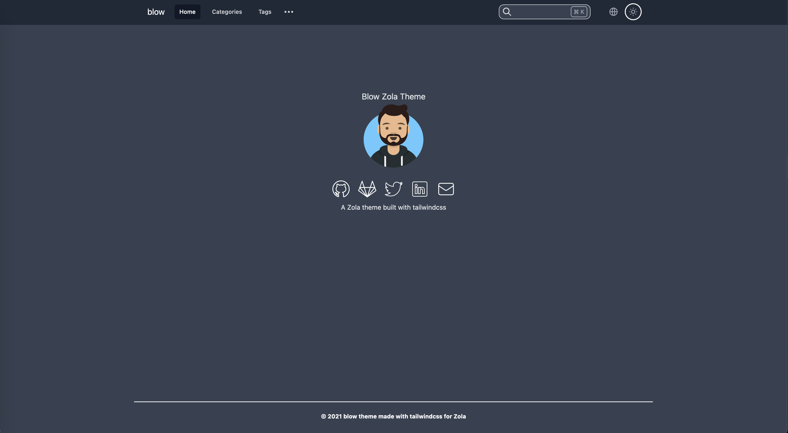

+++
title = "Blow"
description = "A Zola theme made with Tailwindcss"
template = "theme.html"
date = 2022-04-23T22:39:45+02:00

[extra]
created = 2022-04-23T22:39:45+02:00
updated = 2022-04-23T22:39:45+02:00
repository = "https://github.com/tchartron/blow.git"
homepage = "https://github.com/tchartron/blow"
minimum_version = "0.9.0"
license = "MIT"
demo = "https://tchartron.com"

[extra.author]
name = "Thomas Chartron"
homepage = "https://tchartron.com"
+++        

# Blow
A [Zola](https://www.getzola.org/) theme built with [tailwindcss](https://tailwindcss.com/)  

(WIP) Example : [Here](https://tchartron.com)  

## Preview


## Usage
You should follow the [official documentation](https://www.getzola.org/documentation/themes/installing-and-using-themes/) about installing a Zola theme.  

I recommend adding the theme as a git submodule :  
```bash
cd my-zola-website
git submodule add -b main git@github.com:tchartron/blow.git themes/blow
```

Edit the theme used in your `config.toml` file
```toml
# The site theme to use.
theme = "blow"
```

Then edit your `config.toml` file to override values from the theme :
```toml
[extra]
enable_search = true
enable_sidebar = true
enable_adsense = true
enable_multilingue = true
adsense_link = "https://pagead2.googlesyndication.com/pagead/js/adsbygoogle.js?client=myclientid"

[extra.lang]
items = [
    { lang = "en", links = [
        { base_url = "/", name = "English" },
        { base_url = "/fr", name = "French" },
    ] },
    { lang = "fr", links = [
        { base_url = "/", name = "Anglais" },
        { base_url = "/fr", name = "Français" },
    ] },
]

[extra.navbar]
items = [
    { lang = "en", links = [
        { url = "/", name = "Home" },
        { url = "/categories", name = "Categories" },
        { url = "/tags", name = "Tags" },
    ] },
    { lang = "fr", links = [
        { url = "/fr", name = "Accueil" },
        { url = "/fr/categories", name = "Categories" },
        { url = "/fr/tags", name = "Tags" },
    ] },
]
title = "title"

[extra.sidebar]
items = [
    { lang = "en", links = [
        { url = "/markdown", name = "Markdown" },
        { url = "/blog", name = "Blog" },
    ] },
    { lang = "fr", links = [
        { url = "/fr/markdown", name = "Markdown" },
        { url = "/fr/blog", name = "Blog" },
    ] },
]

# Index page
[extra.index]
title = "Main title"
image = "https://via.placeholder.com/200"

[extra.default_author]
name = "John Doe"
avatar = "https://via.placeholder.com/200"

[extra.social]
github = "https://github.com/johndoe"
gitlab = "https://gitlab.com/johndoe"
twitter = "https://twitter.com/johndoe"
linkedin = "https://www.linkedin.com/in/john-doe-b1234567/"
email = "john.doe@gmail.com"

[extra.favicon]
favicon = "/icons/favicon.ico"
favicon_16x16 = "/icons/favicon-16x16.png"
favicon_32x32 = "/icons/favicon-32x32.png"
apple_touch_icon = "/icons/apple-touch-icon.png"
android_chrome_512 = "/icons/android-chrome-512x512.png"
android_chrome_192 = "/icons/android-chrome-192x192.png"
manifest = "/icons/site.webmanifest"
```

You can now run `zola serve` and visit : `http://127.0.0.1:1111/` to see your site

## Syntax Highlighting
Blow makes use of Zola code highlighting feature.  
It supports setting a different color scheme depending on the user selected theme (Dark / Light)  
In order to use it you should select the color scheme you want to use for light and dark themes in the list provided [here](https://www.getzola.org/documentation/getting-started/configuration/#syntax-highlighting) and edit your `config.toml` file like this example :  
```toml
highlight_theme = "css"

highlight_themes_css = [
  { theme = "ayu-dark", filename = "syntax-dark.css" },
  { theme = "ayu-light", filename = "syntax-light.css" },
]
```

## Features
- [X] Dark/Light modes (with syntax highlighting depending on selected theme)
- [X] Customizable navbar links
- [X] Tags and Categories taxonomies
- [X] Search functionality supporting Command + K shortcut
- [X] Social links (github, gitlab, twitter, linkedin, email) 
- [X] Postcss build process with cssnano (and tailwindcss tree shaking to reduce final bundle size)
- [X] Uglifyjs build process with minification
- [X] Example script to deploy to Github Pages
- [X] Pagination
- [X] Sidemenu menu with sections links
- [X] Table of content (2 levels and currently viewed part highlighted)
- [X] Multilingue
- [X] 404
- [X] Mobile responsive
- [X] Favicon
- [ ] Adsense

## Deployment
There is a section about deployment in Zola [documentation](https://www.getzola.org/documentation/deployment/overview/) but you'll find an [example](https://github.com/tchartron/blow/blob/main/deploy-github.sh) to deploy your site to github pages

        